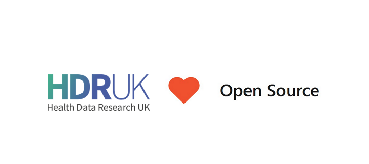

<p align="center">
  
</p>

# HDR UK Open Source Contributions (9)

### GATEWAY (3)
1. [Schemata](https://github.com/HDRUK/schemata) 
2. [Datasets](https://github.com/HDRUK/datasets) 
3. [Papers](https://github.com/HDRUK/papers) 


### GATEWAY-MVP (4)
1. [Gateway-Frontend](https://github.com/HDRUK/Gateway-Frontend) 
2. [Gateway-Auth-Server](https://github.com/HDRUK/Gateway-Auth-Server) 
3. [Gateway-Middleware](https://github.com/HDRUK/Gateway-Middleware) 
4. [Gateway-DB](https://github.com/HDRUK/Gateway-DB) 


### HDRUK (1)
1. [COVID-19](https://github.com/HDRUK/covid-19) 


### UNCATEGORISED (1)
1. [FM-summary](https://github.com/hailianghuang/FM-summary) 


> **Note:** Contributions are noted where there are direct or indirect contributions (funding and support) made by HDR UK to the above projects.

---
### How to add projects

1. Create a [Github.com account](https://github.com/join) if you do not have one already
2. Create a [fork of this project](https://github.com/HDRUK/oss).
3. Edit the [oss_projects.yml](data/oss_projects.yml) file and add an entry for your project using this template:
   ```yaml
   - name: 'Project Awesome'
     description: 'Describe what your project is about'
     url: 'https://github.com/YOUREPO (Provide your Github Repo URL)'
     keywords: [ 'example', 'keyword' ]
     categories: ['HDR UK', 'themes' ]
   ```
4. Commit the changes to your fork and [submit a Pull Request](https://github.com/HDRUK/oss/compare) against the `master` branch of this project.

We'll review all requests and accept them according to HDR UK's policies. If accepted, your project will be listed below